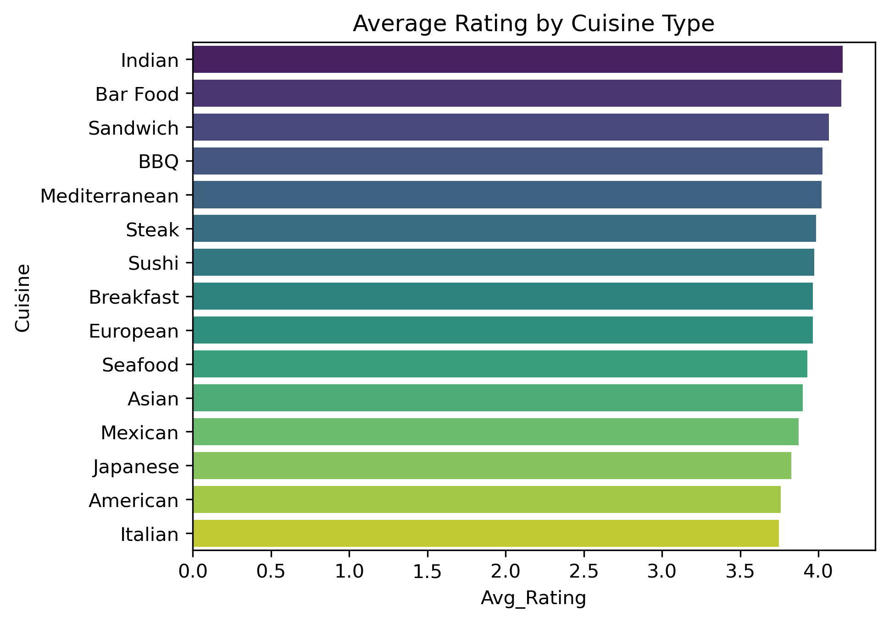
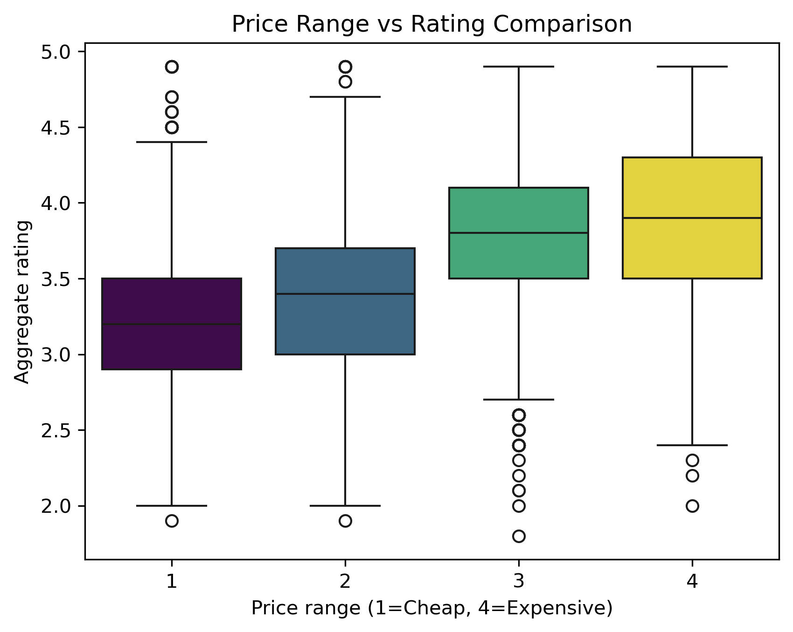
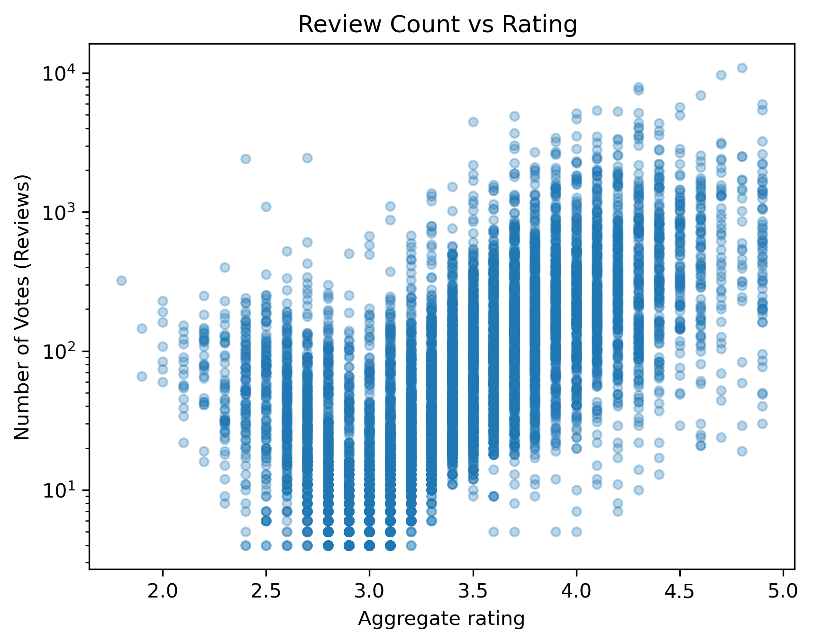
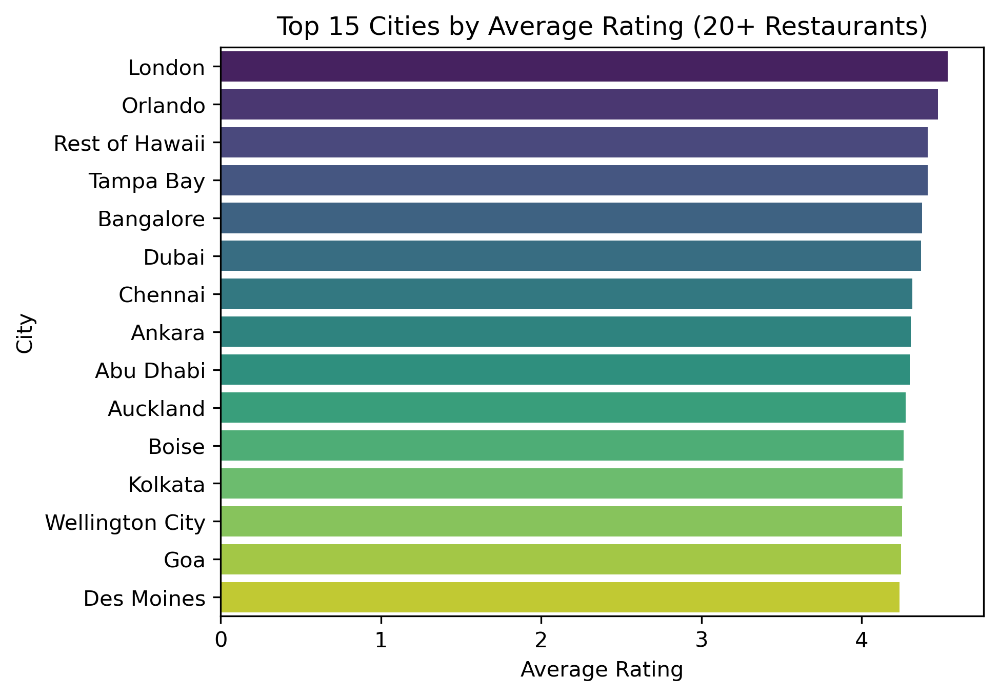
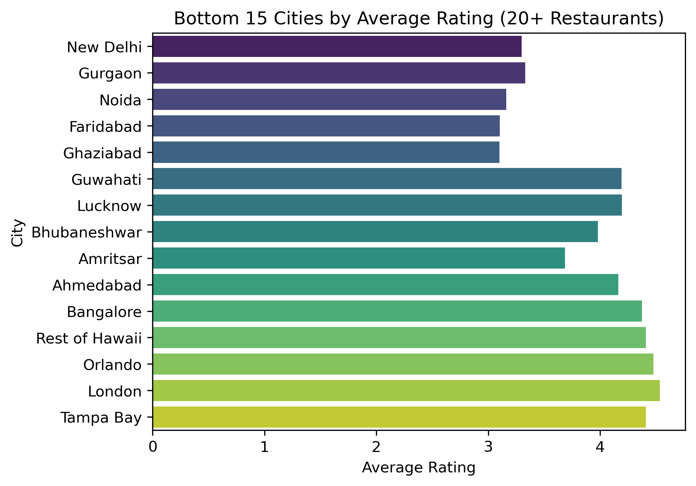
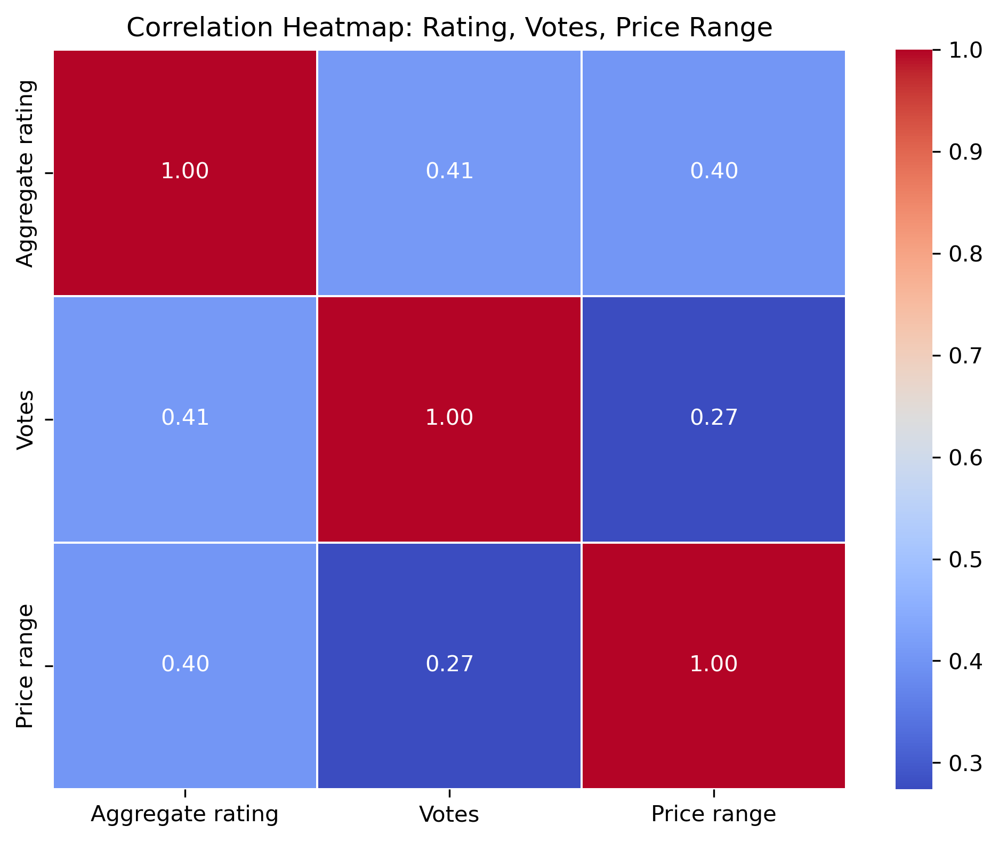

# 🍽️ Restaurant Rating Analysis — EDA Project

## 📌 Overview

What factors actually drive a restaurant's rating — cuisine type, price range, or location? This project analyzes the [Zomato Restaurants Dataset](https://www.kaggle.com/datasets/shrutimehta/zomato-restaurants-data) to surface patterns a restaurant owner could act on.

**Project Type:** Exploratory Data Analysis (EDA)

## 🛠️ Tools

- Python
- Pandas
- Seaborn
- Matplotlib

## 📁 Dataset

**Source:** [Zomato Restaurants Data — Kaggle](https://www.kaggle.com/datasets/shrutimehta/zomato-restaurants-data)

| Column | Description |
|---|---|
| Restaurant Name | Name of the restaurant |
| City | City where the restaurant is located |
| Cuisines | Cuisine type(s) served (comma-separated) |
| Price range | Price category (1 = cheap, 4 = expensive) |
| Average Cost for two | Average cost for two people |
| Aggregate rating | Average customer rating (0–5) |
| Votes | Number of reviews/votes received |

## 🧹 Data Cleaning

- Removed restaurants with `Aggregate rating = 0` (not yet rated)
- Split the `Cuisines` column (comma-separated) and exploded it into individual rows for cuisine-level analysis
- Filtered out cuisines and cities with very low restaurant counts to avoid misleading averages based on tiny sample sizes

---

## 📊 Analysis 1 — Average Rating by Cuisine Type

**Business Question:** Which cuisine types are rated highest by customers?

**Work Done:** The `Cuisines` column was split and exploded so each restaurant's cuisines could be evaluated individually. Average rating was calculated for cuisines with at least 30 restaurants, and the top 15 were plotted as a bar chart.

**Result:** **Indian (4.16)**, **Bar Food (4.15)**, and **Sandwich (4.07)** rank highest. Widely available cuisines — **Chinese (3.28, 2184 restaurants)**, **North Indian (3.30, 3017 restaurants)**, and **Fast Food (3.26, 1563 restaurants)** — rank lower. Niche, less-competitive cuisines show more consistent customer satisfaction than saturated, high-volume categories.

**Visual:**

---

## 📊 Analysis 2 — Price Range vs Rating Comparison

**Business Question:** Do more expensive restaurants actually get higher ratings?

**Work Done:** Using `df_clean`, the distribution of Aggregate rating across Price range categories (1–4) was visualized with a box plot.

**Result:** Median rating rises from Price range 1 to 3, then levels off at 4. However, Price range 3 shows the most low-rating outliers — meaning a higher price does not guarantee consistent quality. Raising prices alone does not guarantee a better rating.

**Visual:**

---

## 📊 Analysis 3 — Review Count vs Rating

**Business Question:** Does popularity (a high number of reviews) mean a higher rating?

**Work Done:** The relationship between Votes (review count) and Aggregate rating was plotted as a scatter plot, with the x-axis on a log scale due to the wide range of Votes values.

**Result:** Low-rated restaurants generally receive few reviews, while high-rated restaurants are spread across a wide range — from just a handful of reviews to over 10,000. A high rating appears to be a prerequisite for popularity, but popularity itself doesn't guarantee a high rating.

**Visual:**

---

## 📊 Analysis 4 — City-Level Performance Breakdown

**Business Question:** Which cities represent the healthiest markets for a restaurant business?

**Work Done:** Restaurants were grouped by `City`, and average rating was calculated for cities with at least 20 restaurants. The top 15 and bottom 15 cities were each plotted as bar charts.

**Result:** **London (4.54)**, **Orlando (4.48)**, and **Rest of Hawaii (4.41)** top the list. The largest, most saturated markets — **New Delhi (3.30, 4048 restaurants)**, **Gurgaon (3.33, 890 restaurants)**, and **Noida (3.16, 696 restaurants)** — show the lowest average ratings. Restaurant density and average rating appear inversely related.

**Visual:**

---

## 📊 Analysis 5 — Correlation Heatmap

**Business Question:** Which numeric variable has the strongest relationship with rating — Votes, Price range, or Cost?

**Work Done:** A Pearson correlation matrix was calculated across `Aggregate rating`, `Votes`, `Price range`, and `Average Cost for two`, and visualized as a heatmap.

**Result:** *(add your own finding here — based on the heatmap values, state which variable correlates most strongly with rating)*

**Visual:**

---

## 💡 Overall Business Conclusion

No single factor — cuisine, price, or location — fully determines a restaurant's rating on its own. Instead, a recurring theme across all analyses is **market saturation and competition level**: niche cuisines, less crowded price segments, and smaller markets consistently show higher average ratings than their saturated
